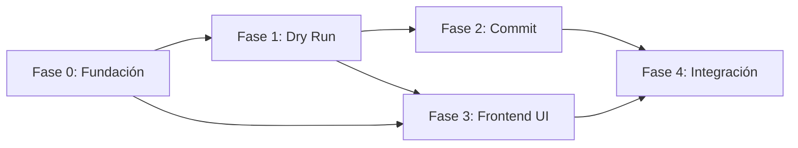

# Plan de Implementación — Feature 001

## Estructura de Archivos Objetivo

```
d:\DesafioTecnico\
├── Spec/                          # ← Spec Driven Development
│   ├── constitution/
│   │   ├── mission.md
│   │   ├── tech-stack.md
│   │   └── roadmap.md
│   └── features/
│       └── 001-tarea/
│           ├── spec.md
│           ├── plan.md
│           └── tasks.md
│
├── backend/                       # ← NestJS
│   ├── src/
│   │   ├── app.module.ts
│   │   ├── main.ts
│   │   ├── config/
│   │   │   └── database.config.ts
│   │   ├── entities/
│   │   │   ├── producto.entity.ts
│   │   │   └── categoria.entity.ts
│   │   ├── upload/
│   │   │   ├── upload.module.ts
│   │   │   ├── upload.controller.ts
│   │   │   ├── upload.service.ts
│   │   │   ├── dto/
│   │   │   │   ├── dry-run-response.dto.ts
│   │   │   │   ├── commit-request.dto.ts
│   │   │   │   └── commit-response.dto.ts
│   │   │   └── interfaces/
│   │   │       ├── preview-row.interface.ts
│   │   │       └── excel-row.interface.ts
│   │   └── common/
│   │       └── filters/
│   │           └── http-exception.filter.ts
│   ├── package.json
│   └── tsconfig.json
│
├── frontend/                      # ← Angular 22
│   ├── src/
│   │   ├── app/
│   │   │   ├── app.component.ts
│   │   │   ├── app.component.html
│   │   │   ├── app.routes.ts
│   │   │   ├── upload/
│   │   │   │   ├── upload.component.ts
│   │   │   │   ├── upload.component.html
│   │   │   │   ├── upload.component.css
│   │   │   │   ├── upload.service.ts
│   │   │   │   ├── upload-state.machine.ts
│   │   │   │   └── models/
│   │   │   │       ├── upload-state.model.ts
│   │   │   │       └── preview-response.model.ts
│   │   │   └── shared/
│   │   │       └── components/
│   │   │           └── confirm-dialog/
│   │   ├── index.html
│   │   └── styles.css
│   ├── package.json
│   ├── angular.json
│   └── tsconfig.json
│
└── database/                      # ← Scripts SQL
    ├── 01-create-database.sql
    ├── 02-create-tables.sql
    └── 03-seed-categorias.sql
```

---

## Plan por Fases

### FASE 0: Fundación

#### 0.1 — Base de Datos
- Crear script `01-create-database.sql` para crear BD `prueba_tecnica` en puerto 3307
- Crear script `02-create-tables.sql` con tablas `categoria` y `producto`
- Crear script `03-seed-categorias.sql` con categorías iniciales de ejemplo

#### 0.2 — Backend (NestJS)
- Inicializar proyecto NestJS con `@nestjs/cli`
- Instalar dependencias: `@nestjs/typeorm`, `typeorm`, `mysql2`, `xlsx`, `multer`, `@nestjs/platform-express`, `class-validator`, `class-transformer`, `uuid`
- Configurar TypeORM con conexión a MySQL (puerto 3307, BD `prueba_tecnica`)
- Crear entidades TypeORM: `Producto` y `Categoria`

#### 0.3 — Frontend (Angular 22)
- Inicializar proyecto Angular 22 con `@angular/cli`
- Configurar proxy para API backend (evitar CORS en dev)
- Estructura base de carpetas

---

### FASE 1: Backend — Dry Run

#### 1.1 — Upload Controller
```typescript
// POST /api/upload
// Acepta multipart/form-data con campo "file"
// Usa @UseInterceptors(FileInterceptor('file'))
// Delega al UploadService.dryRun(file)
```

#### 1.2 — Upload Service: Parsing Excel
```typescript
// Usa xlsx (SheetJS) para leer el buffer del archivo
// Convierte cada fila a ExcelRow interface
// Mapea columnas del Excel a campos de la BD
```

#### 1.3 — Upload Service: Validación
```typescript
// Para cada fila:
//   1. Validar campos requeridos (nombre, sku, stock, color, modelo)
//   2. Validar stock > 0
//   3. Buscar categoría por nombre en BD
//   4. Verificar si SKU existe en BD
//   5. Clasificar: INSERT | UPDATE | ERROR
```

#### 1.4 — Respuesta Dry Run
- Generar `previewToken` (UUID v4) y cachear resultado en memoria (Map)
- Retornar resumen + detalle por fila + token

---

### FASE 2: Backend — Commit

#### 2.1 — Commit Controller
```typescript
// POST /api/upload/commit
// Recibe { previewToken: string }
// Recupera datos cacheados por token
// Delega al UploadService.commit(token)
```

#### 2.2 — Unit of Work
```typescript
// Obtener QueryRunner de TypeORM
// await queryRunner.startTransaction()
// try {
//   Para cada operación válida del preview:
//     INSERT → queryRunner.manager.save(producto)
//     UPDATE → queryRunner.manager.update(Producto, {sku}, {stock})
//   await queryRunner.commitTransaction()
// } catch {
//   await queryRunner.rollbackTransaction()
// } finally {
//   await queryRunner.release()
//   Eliminar preview del cache
// }
```

---

### FASE 3: Frontend — State Machine UI

#### 3.1 — Estado Machine
```typescript
// Estados: IDLE | UPLOADING | PREVIEW | COMMITTING | RESULT | ERROR
// Transiciones controladas por señales/observables
```

#### 3.2 — Componente Upload
- Input de archivo con drag & drop
- Tabla de preview con columnas: Fila, SKU, Nombre, Acción, Estado, Detalle
- Botón de confirmación (doble confirmación con diálogo)
- Vista de resultados finales

#### 3.3 — Servicio HTTP
```typescript
// uploadFile(file: File): Observable<DryRunResponse>
//   → POST /api/upload (multipart/form-data)
//
// commitUpload(token: string): Observable<CommitResponse>
//   → POST /api/upload/commit ({ previewToken })
```

---

## Dependencias entre Fases


